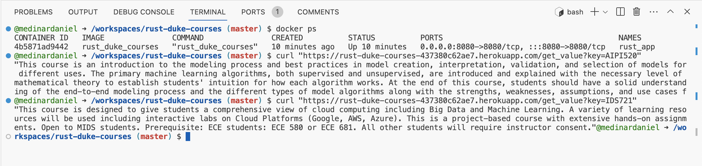
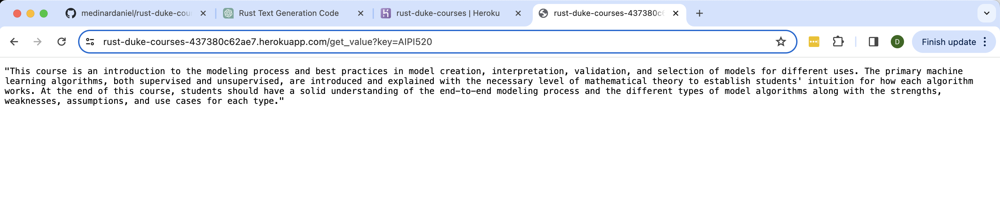

# Duke Courses: Rust Actix Web Application

## Objective

The objective of this project is to build a simple Rust Actix web service and deploy it for experimentation and learning purposes. This project serves as a demonstration of how to develop microservices using Rust and Actix, containerize them using Docker, and deploy to Heroku with continuous integration and continuous deployment (CI/CD) pipeline via GitHub Actions.

## About the Project

This project is a Rust Actix website that integrates CI/CD and is deployed with Heroku. It is designed to return class descriptions for Duke University courses when the user inputs a class code (e.g., AIPI520). This application serves as a basic example of building and deploying a microservice with Rust.

## Rust Microservice Functionality

The microservice uses Actix, a powerful, pragmatic, and extremely fast web framework for Rust. Actix provides out-of-the-box features like routing, request handlers, and responses. In our application, we define endpoints that the user can hit to retrieve class information based on a given code. The data is read from a JSON file representing a mock database for educational purposes.

The core functionality involves parsing the user query, reading from the JSON file, and returning the relevant class information.

## Docker Configuration

We have containerized our Rust Actix application using Docker. This allows our application to run consistently across different environments. Below is the Dockerfile used for this project:

The Dockerfile includes steps for building the Rust application, creating a production-ready Docker image, and setting up the environment for running the microservice.

## CI/CD Pipeline

The Continuous Integration and Continuous Deployment (CI/CD) pipeline is set up using GitHub Actions. The pipeline automates the process of building the Docker image, pushing it to Docker Hub, and deploying the application to Heroku upon any new commits to the main branch.

Below are the key steps involved in our CI/CD pipeline:

1. Checkout the code from the GitHub repository.
2. Log in to Docker Hub.
3. Build and push the Docker image to Docker Hub.
4. Deploy the Docker image to Heroku.

## Deployment (Heroku)

The application is deployed on Heroku, which provides a seamless way to deploy and manage applications in the cloud. We use Heroku's Container Registry to deploy our Docker-based application.

To access the deployed application and test its functionality, use the following URL:
https://rust-duke-courses-437380c62ae7.herokuapp.com/get_value?key=AIPI520

Feel free to test out different Duke Classes. In the URL above you will find the description for AIPI 520, but other classes you can try include:
* IDS721
* IDS706
* AIPI510
* ECE551D
